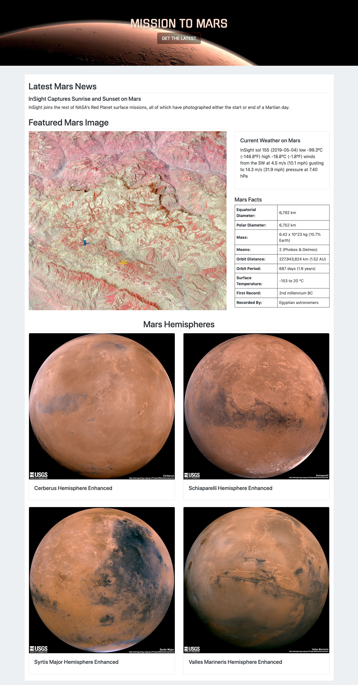
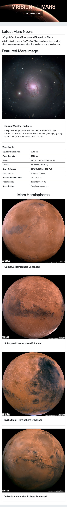

# Mission to Mars

In this project, a web application was created to scrape various websites for data related to the Mission to Mars and display the information in a single HTML page. The following sites were scraped for Mars news, weather, facts, and featured images:

* [NASA Mars News Site](https://mars.nasa.gov/news/)
* [JPL Featured Space Image](https://www.jpl.nasa.gov/spaceimages/?search=&category=Mars)
* [Mars Weather twitter account](https://twitter.com/marswxreport?lang=en)
* [Mars Facts webpage](https://space-facts.com/mars/)
* [USGS Astrogeology site](https://astrogeology.usgs.gov/search/results?q=hemisphere+enhanced&k1=target&v1=Mars)

## Step 1 - Scraping

This repository contains the Jupyter Notebook file `mission_to_mars.ipynb` containing scraping code to return information of interest for the final HTML page. The code in this file is combined into a single scraping function in the file `appfiles/scrape_mars.py` which returns a dictionary of latest information pulled from the sites listed above.

- - -

## Step 2 - MongoDB and Flask Application

MongoDB and Flask templating were used to create a new HTML page for the scraped information (see `appfiles/app.py`). This entailed including a scrape function to return Mars information to store in a Mongo database. The app retrieves information from the database to render as content in an html template, and also provides a route to trigger a new scrape and content update.

Screenshots from the final web app are included below.

- - -

- - -

- - -